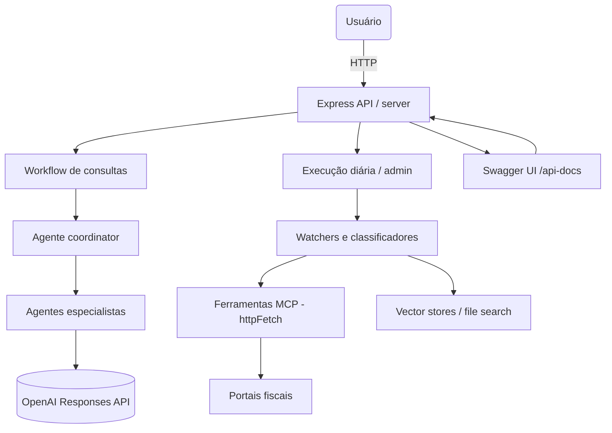

# Tax Virtual Office

Repositório base para o Escritório Tributário Virtual com agentes coordenadores, especialistas e automações para ingestão de documentos fiscais.

## Estrutura

- `agents/`: definições YAML e prompts dos agentes.
- `src/`: código TypeScript para workflows, MCP tools e servidor HTTP.
- `scripts/`: utilitários para cron e manutenção.
- `infra/`: Docker, docker-compose e manifestos Kubernetes.
- `docs/`: documentação de agentes, portais e vector stores.

## Prompts do sistema (versão final)

Todos os prompts de system já estão consolidados e versionados em `agents/prompts/*.system.md`.

- `coordinator.system.md`: orquestra especialistas e ferramentas MCP.
- `specialist-nfce.system.md`, `specialist-nfe.system.md`, `specialist-cte.system.md`: especialistas por documento fiscal.
- `legislacao-ibs-cbs.system.md`: acompanha a reforma tributária.
- `tax-portal-watcher.system.md`: monitora novos documentos em portais fiscais.
- `tax-document-classifier.system.md`: decide vector store e tags de armazenamento.
- `tax-document-uploader.system.md`: fluxo final de upload e catalogação.

## Arquitetura



## Docker Compose

Um `docker-compose.yaml` está disponível em `infra/docker-compose.yaml` com dois serviços:

- `api`: expõe a API HTTP na porta 3000 (`APP_MODE=api`).
- `watcher`: executa o fluxo diário de portais (`APP_MODE=daily-portals-scan`).

Uso básico:

1. Configure `.env` com `OPENAI_API_KEY` e demais variáveis.
2. Suba os contêineres: `docker compose -f infra/docker-compose.yaml up --build`.
3. A API ficará disponível em `http://localhost:3000` e o watcher rodará em background.

## Desenvolvimento

1. Copie `.env.example` para `.env` e ajuste as variáveis.
2. Instale dependências: `npm install`.
3. Ambiente de desenvolvimento: `npm run dev`.
4. Build: `npm run build`.
5. Servidor HTTP: `npm start` (usa `dist/src/index.js`).

## Variáveis de Ambiente

Configure as seguintes variáveis no arquivo `.env`:

- `OPENAI_API_KEY` (obrigatória): Chave da API OpenAI para os agentes.
- `APP_MODE` (opcional): Modo de execução - `api` ou `daily-portals-scan`. Padrão: `api`.
- `PORT` (opcional): Porta do servidor HTTP. Padrão: `3000`.
- `TAX_AGENT_HUB_PATH` (opcional): Caminho para o diretório do `tax-agent-hub`.

### TAX_AGENT_HUB_PATH

Esta variável é usada para acessar recursos do `tax-agent-hub`, incluindo:
- Índice de schemas XSD: `{TAX_AGENT_HUB_PATH}/upload/{domain}/schema-index.json`
- Status de upload: `{TAX_AGENT_HUB_PATH}/upload/{domain}/upload-status.json`

**Quando configurar:**

- **Mesma máquina**: Opcional. Se não configurado, usa caminho relativo `../tax-agent-hub` como fallback.
  ```bash
  TAX_AGENT_HUB_PATH=/caminho/absoluto/para/tax-agent-hub
  ```

- **Máquinas diferentes**: **OBRIGATÓRIO**. Configure com caminho absoluto ou caminho de rede compartilhado.
  ```bash
  # Exemplo: NFS ou mount compartilhado
  TAX_AGENT_HUB_PATH=/mnt/shared/tax-agent-hub
  
  # Exemplo: Caminho absoluto em servidor remoto
  TAX_AGENT_HUB_PATH=/home/user/tax-agent-hub
  ```

**Nota**: O `tax-agent-hub` deve gerar o índice de schemas executando:
```bash
cd tax-agent-hub
npm run generate:schema-index
```

Isso cria os arquivos `schema-index.json` em `upload/{domain}/` que são necessários para a tool `schema-lookup`.

Veja `.env.example` para um template completo.

## Testes

- `npm test` — executa todos os testes.
- `npm run test:watch` — executa testes em modo watch.
- `npm run test:coverage` — gera relatório de cobertura de código.
- `npm run test:classifier` — testa o classificador de documentos.

## Endpoints

### Consultas
- `POST /query` — recebe pergunta do usuário e aciona o agente coordenador.

### Administração
- `GET /health` — healthcheck simples.
- `POST /admin/run-daily` — dispara fluxo diário de monitoramento.
- `POST /admin/classify-document` — classifica um documento fiscal usando o tax-document-classifier.

### Documentação
- `GET /api-docs` — documentação interativa da API (Swagger UI).

## Integração com Cursor e Task Master

Este repositório já inclui um bundle de comandos e regras específico para o projeto:

- `.cursor/rules/`: guardrails de engenharia e fluxo de trabalho (ex.: `invoisys-tax-virtual-office-rules.mdc`, `dev_workflow.mdc`, `git_workflow.mdc`).
- `.cursor/commands/`: comandos prontos do Whitebeard/Task Master (ex.: `wb-quick-start`, `wb-next-task`, `wb-analyze-codebase`).

No Cursor:

1. Abra o projeto `tax-virtual-office`.
2. Abra o painel **Commands** e procure pelos comandos `wb-*`.
3. Siga o comando `wb-quick-start` para onboarding guiado no fluxo de tarefas deste repositório.

## Estado atual da implementação

- O workflow de consulta (`/query`) agora monta o plano com especialistas e ferramentas com base na pergunta, reaproveitando o catálogo de agentes e exibindo quais modelos serão acionados. 【F:src/workflows/user-query.ts†L1-L78】【F:src/agents/registry.ts†L1-L55】
- O coordinator passa a instrumentar o plano retornado com fontes reais (file-search/web) e exemplos de traces de agentes, propagando a lista de especialistas, ferramentas e rastros para facilitar auditoria do fluxo de consulta. 【F:src/agents/coordinator.ts†L1-L78】【F:src/workflows/user-query.ts†L1-L90】
- A varredura de portais (`runDailyPortalsScan` e `/admin/run-daily`) agora faz fetch das listagens, extrai links reais via HTML, deduplica por hash em `agents/.cache/portal-state.json` e registra métricas por portal. Novos itens retornam com `portalId`, `portalType`, `contentHash`, `publishedAt` e `detectedAt`. 【F:src/workflows/daily-portals-scan.ts†L1-L16】【F:src/agents/maintenance.ts†L41-L121】【F:src/agents/maintenance.ts†L171-L221】
- A classificação de documentos usa heurísticas e o catálogo `agents/vectorstores.yaml` para pontuar o melhor `vectorStoreId`, retornando rationale e score sem depender de chamadas de modelo. O upload passa a baixar e persistir o HTML na pasta `agents/.cache/downloads` antes de registrar destino e tags. 【F:src/agents/types.ts†L17-L41】【F:src/agents/maintenance.ts†L70-L108】【F:src/agents/maintenance.ts†L123-L170】
