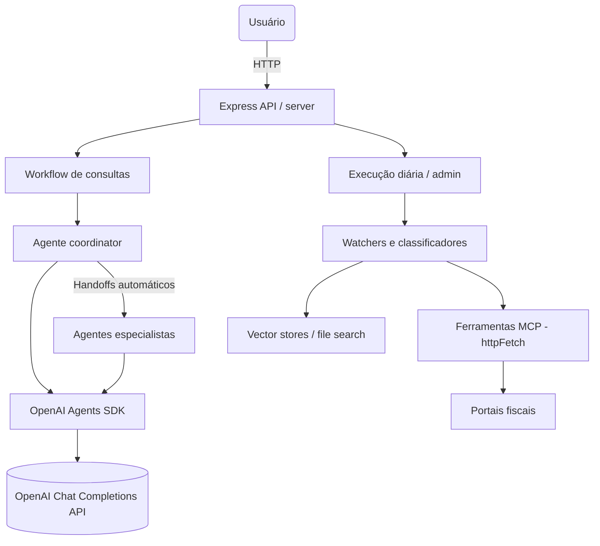

# Tax Virtual Office

Repositório base para o Escritório Tributário Virtual com agentes coordenadores, especialistas e automações para ingestão de documentos fiscais.

## Estrutura

- `agents/`: definições YAML e prompts dos agentes.
- `src/`: código TypeScript para workflows, MCP tools e servidor HTTP.
- `scripts/`: utilitários para cron e manutenção.
- `infra/`: Docker, docker-compose e manifestos Kubernetes.
- `docs/`: documentação de agentes, portais e vector stores.

## Prompts do sistema (versão final)

Todos os prompts de system já estão consolidados e versionados em `agents/prompts/*.system.md`.

- `coordinator.system.md`: orquestra especialistas e ferramentas MCP.
- `specialist-nfce.system.md`, `specialist-nfe.system.md`, `specialist-cte.system.md`: especialistas por documento fiscal.
- `legislacao-ibs-cbs.system.md`: acompanha a reforma tributária.
- `tax-portal-watcher.system.md`: monitora novos documentos em portais fiscais.
- `tax-document-classifier.system.md`: decide vector store e tags de armazenamento.
- `tax-document-uploader.system.md`: fluxo final de upload e catalogação.

## Arquitetura

## Docker Compose

Um `docker-compose.yaml` está disponível em `infra/docker-compose.yaml` com dois serviços:

- `api`: expõe a API HTTP na porta 3000 (`APP_MODE=api`).
- `watcher`: executa o fluxo diário de portais (`APP_MODE=daily-portals-scan`).

Uso básico:

1. Configure `.env` com `OPENAI_API_KEY` e demais variáveis.
2. Suba os contêineres: `docker compose -f infra/docker-compose.yaml up --build`.
3. A API ficará disponível em `http://localhost:3000` e o watcher rodará em background.

## Desenvolvimento

1. Copie `.env.example` para `.env` e ajuste as variáveis.
2. Instale dependências: `npm install`.
3. Ambiente de desenvolvimento: `npm run dev`.
4. Build: `npm run build`.
5. Servidor HTTP: `npm start` (usa `dist/index.js`).

## Endpoints básicos

- `POST /query` — recebe pergunta do usuário e aciona o agente coordenador.
- `GET /health` — healthcheck simples.
- `POST /admin/run-daily` — dispara fluxo diário de monitoramento.

## Integração com Cursor e Task Master

Este repositório já inclui um bundle de comandos e regras específico para o projeto:

- `.cursor/rules/`: guardrails de engenharia e fluxo de trabalho (ex.: `invoisys-tax-virtual-office-rules.mdc`, `dev_workflow.mdc`, `git_workflow.mdc`).
- `.cursor/commands/`: comandos prontos do Whitebeard/Task Master (ex.: `wb-quick-start`, `wb-next-task`, `wb-analyze-codebase`).

No Cursor:

1. Abra o projeto `tax-virtual-office`.
2. Abra o painel **Commands** e procure pelos comandos `wb-*`.
3. Siga o comando `wb-quick-start` para onboarding guiado no fluxo de tarefas deste repositório.

## Estado atual da implementação

- **Migração para OpenAI Agents SDK**: Todos os agentes agora usam o [OpenAI Agents SDK](https://github.com/openai/openai-agents-js) para gerenciamento de agentes, handoffs automáticos e agent loops. 【F:src/agents/agents-sdk.ts】【F:src/agents/tools.ts】
- **Handoffs Automáticos**: O coordinator usa `Agent.create()` com handoffs configurados para especialistas. Handoffs são gerenciados automaticamente pelo SDK durante a execução. 【F:src/agents/coordinator.ts】【F:src/agents/agents-sdk.ts】
- **Tools com Validação Zod**: Todas as ferramentas MCP são implementadas usando `tool()` helper do SDK com validação de parâmetros via Zod. 【F:src/agents/tools.ts】
- **Modelos do Registry**: Especialistas agora respeitam os modelos configurados em `agents.yaml` (sem hardcode). 【F:src/agents/specialist.ts】
- O workflow de consulta (`/query`) monta o plano com especialistas e ferramentas, com handoffs gerenciados automaticamente pelo Agents SDK. 【F:src/workflows/user-query.ts】
- A varredura de portais (`runDailyPortalsScan` e `/admin/run-daily`) faz fetch das listagens, extrai links reais via HTML, deduplica por hash em `agents/.cache/portal-state.json` e registra métricas por portal. 【F:src/workflows/daily-portals-scan.ts】【F:src/agents/maintenance.ts】
- A classificação de documentos usa heurísticas e o catálogo `agents/vectorstores.yaml` para pontuar o melhor `vectorStoreId`, retornando rationale e score sem depender de chamadas de modelo. 【F:src/agents/maintenance.ts】
