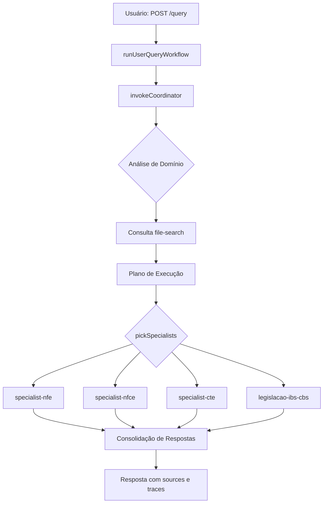
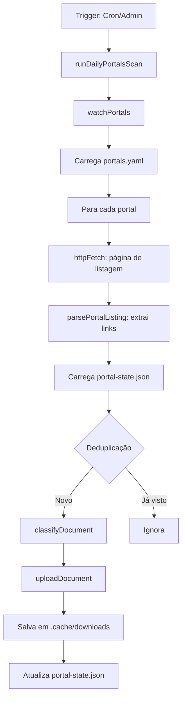
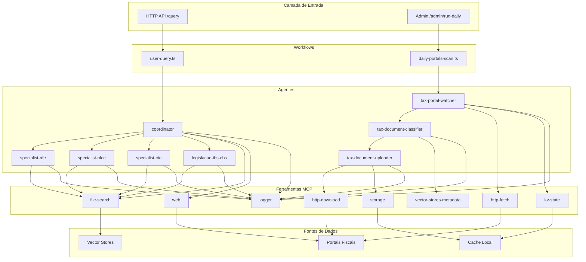

# Arquitetura de Agentes - Tax Virtual Office

## Visão Geral

O Tax Virtual Office utiliza uma arquitetura baseada em **agentes especializados** que trabalham em conjunto para processar consultas tributárias e automatizar a ingestão de documentos fiscais. A arquitetura segue o padrão **coordinator-specialist** com ferramentas MCP (Model Context Protocol) para acesso a fontes de dados.

## Tipos de Agentes

### 1. Agente Coordenador (`coordinator`)

**Responsabilidade**: Orquestrar especialistas e ferramentas para responder consultas do usuário.

**Características**:
- **Modelo**: `gpt-5.1`
- **Ferramentas**: `file-search`, `web`, `logger`
- **Prompt**: `agents/prompts/coordinator.system.md`

**Fluxo de Trabalho**:
1. Recebe pergunta do usuário via `/query`
2. Analisa domínio (NF-e, NFC-e, CT-e, IBS/CBS, Misto)
3. Consulta `file-search` em vector stores prioritários
4. Planeja execução com especialistas e ferramentas
5. Aciona especialistas apropriados
6. Consolida respostas com fontes e traces

**Políticas**:
- **SEMPRE** consultar `file-search` antes de responder
- **NUNCA** inventar números de lei, artigos, NTs ou prazos sem base documental
- Explicitar limitações quando não houver base suficiente
- Citar fontes formais (lei, decreto, NT, manual, schema)

**Vector Stores Prioritários**:
- `legislacao-nacional-ibs-cbs-is` (IBS/CBS/IS, EC 132/2023, LC 214/2025)
- `normas-tecnicas-nfe-nfce-cte` (NTs, manuais, schemas XML, FAQs)
- `documentos-estaduais-ibc-cbs` (normas estaduais)
- `jurisprudencia-tributaria` (pareceres, decisões, consultas)
- `legis-nfe-exemplos-xml` (exemplos de XML, XSD, guias)

### 2. Especialistas em Documentos Fiscais

#### 2.1. Especialista NF-e (`specialist-nfe`)

**Responsabilidade**: Responder questões técnicas sobre NF-e modelo 55.

**Características**:
- **Modelo**: `gpt-5.1`
- **Ferramentas**: `file-search`, `logger`
- **Prompt**: `agents/prompts/specialist-nfe.system.md`

**Escopo**:
- Emissão, autorização, rejeição, cancelamento, inutilização
- Eventos (Carta de Correção, Manifestação, EPEC)
- Estrutura XML e schemas XSD
- Web services SEFAZ
- Regras de validação (CST, CFOP, NCM, CST/CSOSN)
- Notas técnicas e manuais oficiais

**Vector Stores Primários**:
- `normas-tecnicas-nfe-nfce-cte`
- `legis-nfe-exemplos-xml`

**Vector Stores Secundários**:
- `legislacao-nacional-ibs-cbs-is` (quando envolver reforma tributária)
- `documentos-estaduais-ibc-cbs` (regras específicas de UF)

#### 2.2. Especialista NFC-e (`specialist-nfce`)

**Responsabilidade**: Responder questões técnicas sobre NFC-e modelo 65.

**Características**:
- **Modelo**: `gpt-5.1`
- **Ferramentas**: `file-search`, `logger`
- **Prompt**: `agents/prompts/specialist-nfce.system.md`

**Escopo**: Similar ao NF-e, mas focado em NFC-e (Nota Fiscal de Consumidor Eletrônica).

#### 2.3. Especialista CT-e (`specialist-cte`)

**Responsabilidade**: Responder questões técnicas sobre CT-e, CT-e OS e MDF-e.

**Características**:
- **Modelo**: `gpt-5.1`
- **Ferramentas**: `file-search`, `logger`
- **Prompt**: `agents/prompts/specialist-cte.system.md`

**Escopo**: Conhecimento Técnico de Transporte Eletrônico e Manifesto de Documentos Fiscais.

### 3. Especialista em Legislação (`legislacao-ibs-cbs`)

**Responsabilidade**: Responder questões sobre reforma tributária (IBS/CBS/IS).

**Características**:
- **Modelo**: `gpt-5.1-pro` (modelo mais avançado)
- **Ferramentas**: `file-search`, `logger`
- **Prompt**: `agents/prompts/legislacao-ibs-cbs.system.md`

**Escopo**:
- EC 132/2023 (Emenda Constitucional da Reforma Tributária)
- LC 214/2025 (Lei Complementar IBS/CBS/IS)
- Transição 2026-2033
- Decretos e regulamentos relacionados
- Impactos sobre documentos fiscais eletrônicos

**Vector Stores Primários**:
- `legislacao-nacional-ibs-cbs-is`
- `documentos-estaduais-ibc-cbs`

### 4. Agentes de Manutenção

#### 4.1. Monitor de Portais (`tax-portal-watcher`)

**Responsabilidade**: Monitorar portais fiscais e detectar novos documentos.

**Características**:
- **Modelo**: `gpt-5.1`
- **Ferramentas**: `http-fetch`, `kv-state`, `logger`, `task-queue`
- **Prompt**: `agents/prompts/tax-portal-watcher.system.md`

**Fluxo de Trabalho**:
1. Lê configuração de portais em `agents/portals.yaml`
2. Faz fetch das páginas de listagem via `http-fetch`
3. Extrai links e metadados (título, data, URL)
4. Carrega estado anterior via `kv-state` (hashes/URLs já vistos)
5. Filtra apenas documentos novos (deduplicação)
6. Gera `contentHash` para cada documento novo
7. Atualiza `kv-state` com novos hashes
8. Retorna JSON padronizado com novos documentos

**Formato de Saída**:
```json
{
  "items": [
    {
      "portalId": "string",
      "portalType": "nacional|estadual",
      "title": "string",
      "url": "string",
      "publishedAt": "YYYY-MM-DDTHH:mm:ssZ|null",
      "detectedAt": "YYYY-MM-DDTHH:mm:ssZ",
      "contentHash": "string"
    }
  ]
}
```

**Portais Monitorados** (configurados em `agents/portals.yaml`):
- ENCAT NFC-e
- Portal Nacional NF-e
- CONFAZ Ajustes SINIEF
- SEFAZ-SP NFC-e
- SEFAZ-MG NF-e

#### 4.2. Classificador de Documentos (`tax-document-classifier`)

**Responsabilidade**: Decidir para qual vector store cada documento deve ser enviado.

**Características**:
- **Modelo**: `gpt-5.1`
- **Ferramentas**: `vector-stores-metadata`, `logger`
- **Prompt**: `agents/prompts/tax-document-classifier.system.md`

**Fluxo de Trabalho**:
1. Recebe metadados do documento (portal, título, URL, datas)
2. Consulta `vector-stores-metadata` para ler `agents/vectorstores.yaml`
3. Aplica heurísticas baseadas em:
   - Título (keywords: "NT", "Nota Técnica", "Lei Complementar", etc.)
   - Portal de origem (`portalId`, `portalType`)
   - URL (padrões: `/nt/`, `/lei/`, `/ajuste/`, `/schema/`)
4. Calcula `confidenceScore` (0.0 a 1.0)
5. Gera `rationale` explicando a decisão
6. Retorna classificação com tags

**Formato de Saída**:
```json
{
  "targetVectorStoreId": "string",
  "tags": ["string"],
  "confidenceScore": 0.0,
  "rationale": "string"
}
```

**Heurísticas de Classificação**:
- Títulos com "NT", "Nota Técnica", "Manual", "schema", "XML" → `normas-tecnicas-nfe-nfce-cte` ou `legis-nfe-exemplos-xml`
- Títulos com "Lei Complementar", "LC", "Decreto" (nacional) → `legislacao-nacional-ibs-cbs-is`
- CONFAZ, Ajustes SINIEF, convênios → `documentos-estaduais-ibc-cbs`
- "Parecer", "Solução de Consulta", "Acórdão" → `jurisprudencia-tributaria`

#### 4.3. Uploader de Documentos (`tax-document-uploader`)

**Responsabilidade**: Baixar, armazenar e catalogar documentos fiscais.

**Características**:
- **Modelo**: `4o-mini` (modelo mais leve para tarefas simples)
- **Ferramentas**: `http-download`, `file-search-upload`, `storage`, `logger`
- **Prompt**: `agents/prompts/tax-document-uploader.system.md`

**Fluxo de Trabalho**:
1. Recebe documento classificado (URL, vector store, tags)
2. Baixa conteúdo via `http-download`
3. Salva em `agents/.cache/downloads/` com nome padronizado
4. Registra destino e tags no vector store
5. Opcionalmente envia para File Search via `file-search-upload`

## Vector Stores

Os vector stores são repositórios de conhecimento especializados definidos em `agents/vectorstores.yaml`:

### 1. `legislacao-nacional-ibs-cbs-is`
- **Descrição**: Leis complementares, emendas, decretos, regulamentos sobre IBS, CBS e IS em âmbito nacional.
- **Uso**: Consultas sobre reforma tributária, EC 132/2023, LC 214/2025.

### 2. `normas-tecnicas-nfe-nfce-cte`
- **Descrição**: Notas técnicas, manuais, esquemas XML, FAQs oficiais de NF-e, NFC-e, CT-e, MDF-e.
- **Uso**: Questões técnicas sobre documentos fiscais eletrônicos.

### 3. `documentos-estaduais-ibc-cbs`
- **Descrição**: Normas estaduais sobre IBS/CBS/IS vinculadas aos documentos eletrônicos.
- **Uso**: Regras específicas de estados.

### 4. `jurisprudencia-tributaria`
- **Descrição**: Jurisprudência e pareceres relevantes à reforma tributária e documentos fiscais.
- **Uso**: Consultas sobre interpretações e decisões.

### 5. `legis-nfe-exemplos-xml`
- **Descrição**: XMLs de exemplo, esquemas e guias de implementação específicos de NF-e.
- **Uso**: Referências técnicas e exemplos práticos.

## Ferramentas MCP (Model Context Protocol)

### 1. `file-search`
- **Uso**: Busca em vector stores e arquivos locais.
- **Agentes**: coordinator, specialists, classifier
- **Prioridade**: Fonte primária de informação

### 2. `web`
- **Uso**: Consultas a sites oficiais (apenas domínios `.gov.br`, `.fazenda.gov.br`, etc.).
- **Agentes**: coordinator
- **Restrição**: Apenas para dados objetivos (datas, números de lei, URLs oficiais)

### 3. `http-fetch`
- **Uso**: Obter HTML de páginas de portais fiscais.
- **Agentes**: tax-portal-watcher
- **Implementação**: `src/mcp/httpFetchTool.ts`

### 4. `http-download`
- **Uso**: Baixar arquivos de documentos fiscais.
- **Agentes**: tax-document-uploader
- **Implementação**: `src/mcp/httpDownloadTool.ts`

### 5. `kv-state`
- **Uso**: Armazenar estado de documentos já processados (deduplicação).
- **Agentes**: tax-portal-watcher
- **Implementação**: `src/mcp/kvStateTool.ts`
- **Armazenamento**: `agents/.cache/portal-state.json`

### 6. `vector-stores-metadata`
- **Uso**: Ler configuração de vector stores disponíveis.
- **Agentes**: tax-document-classifier
- **Fonte**: `agents/vectorstores.yaml`

### 7. `file-search-upload`
- **Uso**: Enviar documentos para File Search após processamento.
- **Agentes**: tax-document-uploader

### 8. `storage`
- **Uso**: Persistir arquivos baixados.
- **Agentes**: tax-document-uploader
- **Implementação**: `src/mcp/storageTool.ts`
- **Localização**: `agents/.cache/downloads/`

### 9. `logger`
- **Uso**: Registrar decisões, chamadas de ferramentas e traces.
- **Agentes**: Todos
- **Implementação**: `src/mcp/loggerTool.ts`

### 10. `task-queue`
- **Uso**: Enfileirar documentos para processamento posterior.
- **Agentes**: tax-portal-watcher (opcional)

## Fluxos de Trabalho

### 1. Fluxo de Consulta do Usuário (`/query`)



**Etapas**:
1. Usuário envia pergunta via `POST /query`
2. `runUserQueryWorkflow()` é acionado
3. `invokeCoordinator()` analisa a pergunta e consulta `file-search`
4. `pickSpecialists()` identifica especialistas necessários (heurística baseada em keywords)
5. Especialistas são acionados (se necessário)
6. Resposta consolidada retorna com:
   - `answer`: Resposta final
   - `plan`: Plano de execução
   - `sources`: Fontes consultadas
   - `agentTraces`: Traces de agentes e ferramentas

### 2. Fluxo de Varredura Diária (`/admin/run-daily`)



**Etapas**:
1. Trigger via cron ou `POST /admin/run-daily`
2. `runDailyPortalsScan()` é executado
3. `watchPortals()`:
   - Lê `agents/portals.yaml`
   - Faz fetch de cada portal via `httpFetch`
   - Extrai documentos via regex HTML
   - Deduplica por `contentHash` usando `portal-state.json`
4. Para cada documento novo:
   - `classifyDocument()` decide vector store e tags
   - `uploadDocument()` baixa e salva o arquivo
5. Estado atualizado em `agents/.cache/portal-state.json`

## Registro de Agentes

Os agentes são registrados em `agents/agents.yaml` e carregados dinamicamente via `src/agents/registry.ts`.

**Estrutura de Definição**:
```yaml
agents:
  - id: coordinator
    name: Tax Virtual Office Coordinator
    model: gpt-5.1
    instructions_file: ./prompts/coordinator.system.md
    tools:
      - file-search
      - web
      - logger
```

**Carregamento**:
- `getAgentDefinition(agentId)` lê `agents.yaml`
- Carrega prompt do arquivo `instructions_file`
- Cache em memória para performance
- Validação de estrutura YAML

## Políticas de Alucinação

Todos os agentes seguem políticas rigorosas para evitar alucinações:

### Regras Gerais

**NUNCA inventar**:
- Números de lei, artigos, incisos, parágrafos ou datas
- Trechos de XML, nomes de tags, campos de schema
- Códigos de rejeição ou mensagens de erro
- Prazos (cancelamento, inutilização, contingência) sem base documental

**SEMPRE**:
- Consultar `file-search` antes de responder
- Citar fontes formais quando fizer afirmações normativas
- Explicitar limitações quando não houver base suficiente
- Declarar "**Não localizei documentação oficial interna suficiente**" quando apropriado

### Políticas por Agente

**Coordinator**:
- Prioriza `file-search` sobre `web`
- Usa `web` apenas para dados objetivos em domínios oficiais
- Explicita escopo (nacional vs estadual, NF-e vs NFC-e)

**Specialists**:
- Consulta vector stores técnicos antes de responder
- Cita documento oficial exato (NT, MOC, schema)
- Explicita versão de layout ou NT

**Classifier**:
- Baseia decisão apenas em metadados (não inventa conteúdo)
- Usa `confidenceScore` conservador quando ambíguo
- Nunca inventa vector stores que não existam

## Formato de Respostas

### Resposta do Coordinator

```typescript
interface UserQueryResponse {
  answer: string;                    // Resposta consolidada
  sources?: string[];                // Fontes consultadas
  plan?: string[];                   // Plano de execução
  agentTraces?: AgentTraceExample[]; // Traces de agentes
}
```

**Estrutura da Resposta**:
1. **Resumo de alto nível** (2-4 frases)
2. **Análise técnica detalhada** (requisitos legais, regras de negócio)
3. **Plano de ação sugerido** (quando aplicável)
4. **Fontes consultadas** (tabela com tipo, vector store, referência)
5. **Limitações e incertezas** (quando não houver base suficiente)

### Resposta do Portal Watcher

```json
{
  "items": [
    {
      "portalId": "encat-nfce",
      "portalType": "nacional",
      "title": "Nota Técnica 2025.001",
      "url": "https://...",
      "publishedAt": "2025-01-15T10:00:00Z",
      "detectedAt": "2025-01-16T08:30:00Z",
      "contentHash": "sha256..."
    }
  ]
}
```

### Resposta do Classifier

```json
{
  "targetVectorStoreId": "normas-tecnicas-nfe-nfce-cte",
  "tags": ["portal:encat-nfce", "tipo:nota-tecnica", "ano:2025"],
  "confidenceScore": 0.85,
  "rationale": "Título menciona 'Nota Técnica' e portal é especializado em NFC-e"
}
```

## Configuração

### Arquivos de Configuração

1. **`agents/agents.yaml`**: Catálogo de agentes
2. **`agents/portals.yaml`**: Portais fiscais monitorados
3. **`agents/vectorstores.yaml`**: Vector stores disponíveis
4. **`agents/prompts/*.system.md`**: Prompts de sistema versionados

### Variáveis de Ambiente

- `OPENAI_API_KEY`: Chave da API OpenAI
- `APP_MODE`: `api` ou `daily-portals-scan`
- `PORT`: Porta do servidor HTTP (padrão: 3000)

### Cache e Estado

- **`agents/.cache/portal-state.json`**: Estado de documentos já processados
- **`agents/.cache/downloads/`**: Arquivos baixados dos portais
- **Cache em memória**: Definições YAML carregadas uma vez

## Integração com OpenAI Responses API

Todos os agentes usam a **OpenAI Responses API** (não Chat Completions):

```typescript
const completion = await openaiClient.responses.create({
  model: coordinator.model,
  input: messages, // Array de mensagens com role e content
});
```

**Estrutura de Mensagens**:
```typescript
[
  {
    role: "system",
    content: [{ type: "input_text", text: instructions }]
  },
  {
    role: "user",
    content: [{ type: "input_text", text: question }]
  }
]
```

**Extração de Resposta**:
```typescript
const answer = extractFirstText(completion.output);
```

## Monitoramento e Logging

### Logger Tool

Todos os agentes usam `logger` para registrar:
- Especialistas acionados
- Vector stores consultados
- Queries principais
- Ausência de base documental
- Decisões de encaminhamento

### Traces de Agentes

Cada resposta inclui `agentTraces` com:
- `agentId`: ID do agente
- `calledTools`: Ferramentas utilizadas
- `sample`: Exemplo de trace
- `note`: Observações

## Extensibilidade

### Adicionar Novo Agente

1. Criar prompt em `agents/prompts/[agent-id].system.md`
2. Adicionar entrada em `agents/agents.yaml`:
   ```yaml
   - id: novo-agente
     name: Nome do Agente
     model: gpt-5.1
     instructions_file: ./prompts/novo-agente.system.md
     tools:
       - file-search
       - logger
   ```
3. Adicionar `AgentId` em `src/agents/types.ts`
4. Implementar lógica específica (se necessário) em `src/agents/`

### Adicionar Novo Portal

1. Adicionar entrada em `agents/portals.yaml`:
   ```yaml
   - id: novo-portal
     name: Nome do Portal
     baseUrl: "https://..."
     listingPath: "/caminho"
     type: "nacional|estadual"
   ```

### Adicionar Novo Vector Store

1. Adicionar entrada em `agents/vectorstores.yaml`:
   ```yaml
   - id: novo-vector-store
     description: "Descrição do propósito"
   ```

## Limitações Conhecidas

Esta seção documenta limitações técnicas e comportamentos conhecidos da arquitetura atual:

### 1. Parsing HTML via Regex

**Limitação**: O `tax-portal-watcher` usa regex para extrair links de páginas HTML (`parsePortalListing()` em `src/agents/maintenance.ts`).

**Impacto**:
- Pode falhar com HTML complexo ou malformado
- Não lida bem com JavaScript dinâmico (SPAs)
- Pode perder links em estruturas HTML aninhadas

**Workaround**:
- Portais com HTML simples funcionam bem
- Para portais complexos, considerar usar biblioteca de parsing HTML (ex.: `cheerio`, `jsdom`)

**Código Afetado**: `src/agents/maintenance.ts:192-236`

### 2. Cache em Memória sem Invalidação

**Limitação**: Definições YAML (agentes, portais, vector stores) são carregadas uma vez e mantidas em cache em memória.

**Impacto**:
- Mudanças em `agents.yaml`, `portals.yaml` ou `vectorstores.yaml` requerem restart do processo
- Não há hot-reload automático de configurações

**Workaround**:
- Reiniciar o serviço após alterar configurações YAML
- Para desenvolvimento, usar `ts-node-dev` que reinicia automaticamente

**Código Afetado**: 
- `src/agents/registry.ts:24` (cache de agentes)
- `src/agents/maintenance.ts:38-40` (cache de portais e vector stores)

### 3. Modelo Hardcoded em invokeSpecialist

**Limitação**: A função `invokeSpecialist()` em `src/agents/specialist.ts` usa modelo hardcoded `gpt-4o-mini` em vez de usar o modelo definido no registry.

**Impacto**:
- Especialistas sempre usam `gpt-4o-mini`, ignorando o modelo configurado em `agents.yaml`
- Inconsistência entre configuração e execução

**Workaround**:
- Atualmente, todos os especialistas usam `gpt-4o-mini` independente da configuração
- Para usar modelos diferentes, modificar `src/agents/specialist.ts:12` para ler do registry

**Código Afetado**: `src/agents/specialist.ts:12`

### 4. Heurística Simples de Seleção de Especialistas

**Limitação**: `pickSpecialists()` usa apenas keywords simples (ex.: "nfc", "nf-e", "cte", "ibs") para identificar especialistas.

**Impacto**:
- Pode selecionar especialistas incorretos para perguntas ambíguas
- Não considera contexto semântico da pergunta
- Pode acionar múltiplos especialistas desnecessariamente

**Workaround**:
- Perguntas específicas funcionam bem
- Para perguntas genéricas, todos os especialistas são acionados (comportamento conservador)

**Código Afetado**: `src/workflows/user-query.ts:50-75`

### 5. Deduplicação Baseada em Hash

**Limitação**: Deduplicação de documentos usa `contentHash` baseado em `portalId:url:title`.

**Impacto**:
- Se o título mudar, o mesmo documento pode ser processado novamente
- URLs com parâmetros de query diferentes são tratadas como documentos diferentes
- Não detecta documentos duplicados com títulos diferentes

**Workaround**:
- Funciona bem para a maioria dos casos
- Para melhor deduplicação, considerar usar hash do conteúdo HTML completo

**Código Afetado**: `src/agents/maintenance.ts:252-257`

### 6. Falta de Tratamento de Erros em Alguns Pontos

**Limitação**: Algumas funções não têm tratamento explícito de erros (ex.: `httpFetch` pode falhar silenciosamente).

**Impacto**:
- Erros de rede podem não ser propagados adequadamente
- Falhas em um portal podem interromper o processamento de outros portais

**Workaround**:
- Adicionar try/catch em pontos críticos
- Implementar retry logic para requisições HTTP

**Código Afetado**: `src/mcp/httpFetchTool.ts`, `src/workflows/daily-portals-scan.ts`

## Exemplos Práticos

### Exemplo 1: Fluxo Completo de Consulta

**Cenário**: Usuário pergunta sobre prazo de cancelamento de NF-e.

**Request**:
```bash
curl -X POST http://localhost:3000/query \
  -H "Content-Type: application/json" \
  -d '{
    "question": "Qual o prazo para cancelar uma NF-e?",
    "context": "Empresa precisa cancelar nota emitida há 2 dias"
  }'
```

**Fluxo Interno**:
1. `runUserQueryWorkflow()` recebe a requisição
2. `invokeCoordinator()` analisa a pergunta
3. `pickSpecialists()` identifica keywords "nf-e" → seleciona `specialist-nfe`
4. Coordinator consulta `file-search` em `normas-tecnicas-nfe-nfce-cte`
5. Coordinator monta plano de execução
6. Resposta consolidada é retornada

**Response** (exemplo):
```json
{
  "answer": "O prazo para cancelamento de NF-e é de até 30 dias corridos a partir da data de autorização, conforme estabelecido na Nota Técnica 2019.001, seção 8.2. Após esse prazo, a nota não pode ser cancelada e deve ser emitida uma Carta de Correção Eletrônica (CCe) se houver necessidade de ajuste...",
  "plan": [
    "Carregar instruções do coordinator e mapear especialistas disponíveis.",
    "Consultar file-search em docs/ e agents/prompts para recuperar legislações relevantes.",
    "Acionar web/http-fetch apenas quando necessário, priorizando portais oficiais.",
    "Distribuir follow-ups para especialistas adequados (specialist-nfe) com contexto extraído.",
    "Consolidar resposta com referências explícitas e anexar trace resumindo ferramentas usadas.",
    "Especialistas acionados: NF-e Specialist.",
    "Ferramentas previstas: file-search, logger."
  ],
  "sources": [
    "agents/prompts/coordinator.system.md",
    "docs/WORKFLOWS.md",
    "docs/PORTAIS.md",
    "NF-e Specialist",
    "docs/AGENTS.md",
    "docs/WORKFLOWS.md"
  ],
  "agentTraces": [
    {
      "agentId": "coordinator",
      "calledTools": ["file-search:docs/WORKFLOWS.md", "web:portal-fazenda"],
      "sample": "[coordinator] file-search → encontrou manual de NF-e em docs/PORTAIS.md; web → validou versão do layout no portal da SEFAZ; despacho para specialist-nfe.",
      "note": "Trace mostra decisões do coordinator com fontes locais e externas."
    },
    {
      "agentId": "specialist-nfe",
      "calledTools": ["file-search"],
      "sample": "[specialist-nfe] file-search → extraiu regras de cancelamento de NF-e do FAQ do portal; consolidou notas e citou seção específica na resposta final.",
      "note": "Usado como exemplo de trace para auditar as decisões do especialista."
    }
  ]
}
```

### Exemplo 2: Resposta do Coordinator (Estruturada)

**Pergunta**: "Como funciona o cálculo de ICMS na NF-e com a nova reforma tributária?"

**Resposta Estruturada** (exemplo do formato esperado):

```markdown
## Resumo de Alto Nível

O cálculo de ICMS na NF-e continua seguindo as regras atuais até a transição completa para IBS/CBS, prevista para 2026-2033. A Emenda Constitucional 132/2023 estabelece o cronograma de transição, mas as regras técnicas de preenchimento da NF-e permanecem inalteradas no curto prazo.

## Análise Técnica Detalhada

### Requisitos Legais

Segundo a **Lei Complementar 214/2025, art. 43**, o ICMS continuará sendo calculado e informado na NF-e durante o período de transição. O campo `<vICMS>` na tag `<ICMSTot>` deve ser preenchido conforme as regras estaduais vigentes.

### Regras de Negócio

- **CST/CSOSN**: Mantém-se a codificação atual (00, 10, 20, etc. para CST ou 101, 102, etc. para CSOSN)
- **Base de Cálculo**: Continua sendo o valor da operação, conforme **NT 2019.001, seção C.5.2**
- **Alíquota**: Aplicada conforme legislação estadual de origem

### Impactos por Tipo de Documento

- **NF-e (modelo 55)**: Mantém estrutura atual de ICMS
- **NFC-e (modelo 65)**: Similar à NF-e, com algumas simplificações
- **CT-e**: ICMS sobre transporte segue regras específicas

## Plano de Ação Sugerido

1. Verificar se o ambiente de homologação está atualizado para a versão mais recente do layout NF-e
2. Confirmar com a SEFAZ da UF de origem as alíquotas vigentes
3. Revisar a NT mais recente sobre transição tributária (consultar portal nacional)
4. Monitorar comunicados sobre mudanças no período de transição

## Fontes Consultadas

| Fonte                          | Tipo         | Referência                                       |
|--------------------------------|--------------|--------------------------------------------------|
| normas-tecnicas-nfe-nfce-cte   | vector store | NT 2019.001, seção C.5.2, Projeto NF-e         |
| legislacao-nacional-ibs-cbs-is | vector store | LC 214/2025, arts. 43–50, Ministério da Fazenda |
| specialist-nfe                 | especialista | Análise técnica de campos XML                    |
| legislacao-ibs-cbs             | especialista | EC 132/2023, cronograma de transição             |

## Limitações e Incertezas

**Não localizei documentação oficial interna suficiente sobre**:
- Alíquotas específicas de ICMS por UF (varia por estado)
- Prazos exatos de implementação de mudanças por UF

**Recomendações**:
- Consultar diretamente o portal da SEFAZ da UF de origem
- Verificar comunicados recentes no Portal Nacional da NF-e
```

### Exemplo 3: Documento Classificado pelo Classifier

**Input** (documento detectado pelo watcher):
```json
{
  "portalId": "encat-nfce",
  "portalType": "nacional",
  "title": "Nota Técnica 2025.001 - Atualização do Layout NFC-e",
  "url": "https://www.encat.org.br/nfce-documentos/nt-2025-001",
  "publishedAt": "2025-01-15T10:00:00Z",
  "detectedAt": "2025-01-16T08:30:00Z",
  "contentHash": "a1b2c3d4e5f6..."
}
```

**Processamento**:
1. `classifyDocument()` recebe o documento
2. Analisa título: contém "Nota Técnica" e "NFC-e"
3. Analisa portal: `encat-nfce` é especializado em NFC-e
4. Consulta `vectorstores.yaml` para opções disponíveis
5. Calcula scores:
   - `normas-tecnicas-nfe-nfce-cte`: score 4 (título menciona "Nota Técnica" e "NFC-e")
   - `legislacao-nacional-ibs-cbs-is`: score 0 (não relacionado)
   - Outros: scores menores

**Output** (classificação):
```json
{
  "targetVectorStoreId": "normas-tecnicas-nfe-nfce-cte",
  "tags": [
    "portal:encat-nfce",
    "tipo:nota-tecnica",
    "ano:2025",
    "documento:nfce"
  ],
  "confidenceScore": 0.85,
  "rationale": "Título menciona 'Nota Técnica' e 'NFC-e'; portal é especializado em NFC-e (encat-nfce). Priorizando store de normas técnicas."
}
```

**Próximos Passos**:
1. `uploadDocument()` baixa o conteúdo da URL
2. Salva em `agents/.cache/downloads/normas-tecnicas-nfe-nfce-cte-a1b2c3d4e5f6.html`
3. Registra no vector store com as tags fornecidas
4. Opcionalmente envia para File Search

## Métricas e Observabilidade

### Monitoramento de Performance

#### 1. Logs Estruturados

Todos os agentes usam `logger` tool para registrar eventos. Os logs são escritos via `console.info()` e `console.error()`.

**Formato de Log**:
```typescript
// Info logs
logInfo("Portal varrido", {
  portalId: "encat-nfce",
  parsed: 15,
  novos: 3
});

// Error logs
logError("Falha ao processar portal", {
  portalId: "encat-nfce",
  error: error.message
});
```

**Localização**: Logs são escritos no stdout/stderr do processo.

**Melhorias Futuras**:
- Integrar com sistema de logging estruturado (ex.: Winston, Pino)
- Adicionar correlation IDs para rastrear requisições
- Exportar logs para sistema centralizado (ex.: ELK, Datadog)

#### 2. Métricas de Agentes

**Métricas Disponíveis** (via logs):
- **Portal Watcher**:
  - Número de portais processados
  - Documentos encontrados vs novos
  - Taxa de sucesso por portal
- **Classifier**:
  - Distribuição de classificações por vector store
  - Confidence scores médios
  - Tempo de classificação
- **Coordinator**:
  - Especialistas acionados por consulta
  - Vector stores consultados
  - Tempo de resposta

**Exemplo de Métricas** (extraídas de logs):
```json
{
  "timestamp": "2025-01-16T10:30:00Z",
  "agent": "tax-portal-watcher",
  "metrics": {
    "portals_processed": 5,
    "documents_found": 23,
    "new_documents": 7,
    "success_rate": 1.0
  }
}
```

#### 3. Estado de Processamento

**Arquivo de Estado**: `agents/.cache/portal-state.json`

**Estrutura**:
```json
{
  "lastRun": "2025-01-16T08:30:00Z",
  "seen": {
    "encat-nfce": [
      "hash1",
      "hash2",
      "hash3"
    ],
    "portal-nacional-nfe": [
      "hash4",
      "hash5"
    ]
  }
}
```

**Uso para Monitoramento**:
- Verificar `lastRun` para garantir execução regular
- Contar documentos em `seen` por portal para volume processado
- Detectar portais sem novos documentos (possível problema)

### Debugging de Agentes

#### 1. Traces de Agentes

Cada resposta do coordinator inclui `agentTraces` que mostram:
- Quais agentes foram acionados
- Quais ferramentas foram usadas
- Exemplos de decisões tomadas

**Como Usar**:
```typescript
// Na resposta do /query
const traces = response.agentTraces;
traces.forEach(trace => {
  console.log(`Agent: ${trace.agentId}`);
  console.log(`Tools: ${trace.calledTools.join(', ')}`);
  console.log(`Sample: ${trace.sample}`);
});
```

#### 2. Logs de Ferramentas MCP

**Logger Tool**:
```typescript
// Registrar decisão importante
logInfo("Especialista acionado", {
  agentId: "specialist-nfe",
  question: "Prazo de cancelamento",
  vectorStores: ["normas-tecnicas-nfe-nfce-cte"]
});
```

**Localização dos Logs**:
- Console do processo (stdout/stderr)
- Em produção, redirecionar para arquivo ou sistema de logs

#### 3. Debugging de Classificação

**Verificar Classificação**:
```bash
# Ver estado atual de documentos processados
cat agents/.cache/portal-state.json

# Ver documentos baixados
ls -la agents/.cache/downloads/

# Ver logs do último processamento
# (se redirecionados para arquivo)
tail -f logs/portal-watcher.log
```

**Debug de Heurísticas**:
- Adicionar logs em `scoreVectorStores()` para ver scores calculados
- Verificar rationale retornado pelo classifier
- Comparar confidence scores entre documentos similares

#### 4. Debugging de Consultas

**Verificar Fluxo de Consulta**:
```typescript
// Adicionar logs em pontos-chave
console.log("Question received:", input.question);
console.log("Specialists selected:", specialistIds);
console.log("Tools collected:", tools);
console.log("Response:", response);
```

**Verificar Fontes Consultadas**:
- Verificar `sources` na resposta
- Confirmar que vector stores esperados foram consultados
- Validar que `file-search` foi acionado antes de responder

### Alertas e Monitoramento Recomendados

#### 1. Alertas Críticos

**Portal Watcher**:
- Falha ao processar portal (erro HTTP, timeout)
- Nenhum documento novo por mais de X dias (possível problema no portal)
- Taxa de erro > 10% em processamento

**Coordinator**:
- Tempo de resposta > 30 segundos
- Falha ao consultar vector stores
- Respostas sem fontes consultadas

**Classifier**:
- Confidence score < 0.4 (classificação incerta)
- Documentos não classificados (erro no processamento)

#### 2. Dashboards Recomendados

**Métricas por Agente**:
- Taxa de sucesso
- Tempo médio de processamento
- Número de requisições/execuções

**Métricas por Portal**:
- Documentos encontrados por dia
- Novos documentos por dia
- Taxa de sucesso de fetch

**Métricas de Classificação**:
- Distribuição por vector store
- Confidence scores médios
- Taxa de classificação bem-sucedida

#### 3. Integração com Observabilidade

**Ferramentas Recomendadas**:
- **Prometheus**: Coletar métricas customizadas
- **Grafana**: Visualizar dashboards
- **ELK Stack**: Centralizar logs
- **Sentry**: Capturar erros e exceções

**Exemplo de Métrica Prometheus**:
```typescript
// Adicionar contador de consultas
const queryCounter = new prometheus.Counter({
  name: 'tax_virtual_office_queries_total',
  help: 'Total number of user queries',
  labelNames: ['agent', 'status']
});

// Incrementar em cada consulta
queryCounter.inc({ agent: 'coordinator', status: 'success' });
```

## Referências

- **Código Fonte**: `src/agents/`
- **Configuração**: `agents/*.yaml`
- **Prompts**: `agents/prompts/*.system.md`
- **Workflows**: `src/workflows/`
- **MCP Tools**: `src/mcp/`
- **Documentação**: `docs/`

## Diagrama de Arquitetura Completo



---

**Última atualização**: Baseado na análise do codebase em 2025-01-16
