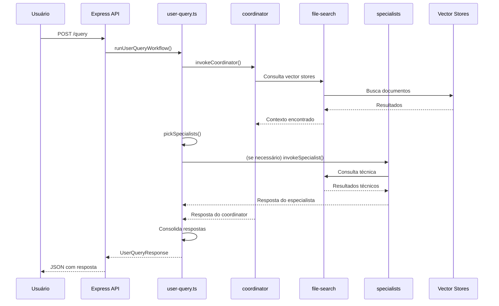

# Workflows Principais

Este documento descreve os principais fluxos de trabalho do Tax Virtual Office, desde consultas de usuários até a ingestão automática de documentos fiscais.

## 1. Workflow de Consulta do Usuário (`/query`)

### Visão Geral

O workflow de consulta permite que usuários façam perguntas sobre documentos fiscais e legislação tributária, recebendo respostas baseadas em fontes oficiais e especialistas.

### Endpoint

```
POST /query
Content-Type: application/json

{
  "question": "Qual o prazo para cancelar uma NF-e?",
  "context": "Empresa precisa cancelar nota emitida há 2 dias",
  "metadata": { ... } // opcional
}
```

### Fluxo Detalhado



### Etapas do Processamento

1. **Recebimento da Requisição**
   - API Express recebe `POST /query`
   - Valida estrutura JSON
   - Chama `runUserQueryWorkflow()`

2. **Análise pelo Coordinator**
   - `invokeCoordinator()` analisa a pergunta
   - Consulta `file-search` em vector stores prioritários
   - Monta plano de execução
   - Identifica domínio (NF-e, NFC-e, CT-e, IBS/CBS, Misto)

3. **Seleção de Especialistas**
   - `pickSpecialists()` usa heurística baseada em keywords:
     - "nfc", "nf-e" ou "nfe" → `specialist-nfe` (NF-e modelo 55 e NFC-e modelo 65)
     - "cte" ou "ct-e" → `specialist-cte`
     - "ibs" ou "cbs" → `legislacao-ibs-cbs`
   - Se nenhum keyword encontrado, aciona todos os especialistas

4. **Consolidação da Resposta**
   - Combina resposta do coordinator com informações dos especialistas
   - Adiciona plano de execução
   - Inclui sources consultadas
   - Gera traces de agentes para auditoria

5. **Retorno ao Cliente**
   - Resposta JSON com:
     - `answer`: Resposta consolidada
     - `plan`: Plano de execução
     - `sources`: Fontes consultadas
     - `agentTraces`: Traces de agentes e ferramentas

### Exemplo de Resposta

```json
{
  "answer": "O prazo para cancelamento de NF-e é de até 30 dias corridos...",
  "plan": [
    "Carregar instruções do coordinator...",
    "Consultar file-search em docs/...",
    "Especialistas acionados: NF-e Specialist.",
    "Ferramentas previstas: file-search, logger."
  ],
  "sources": [
    "agents/prompts/coordinator.system.md",
    "docs/WORKFLOWS.md",
    "docs/PORTAIS.md",
    "NF-e Specialist",
    "docs/AGENTS.md"
  ],
  "agentTraces": [
    {
      "agentId": "coordinator",
      "calledTools": ["file-search:docs/WORKFLOWS.md", "web:portal-fazenda"],
      "sample": "[coordinator] file-search → encontrou manual de NF-e..."
    }
  ]
}
```

### Vector Stores Consultados

O coordinator consulta os seguintes vector stores (em ordem de prioridade):
1. `legislacao-nacional-ibs-cbs-is` (para reforma tributária)
2. `normas-tecnicas-nfe-nfce-cte` (para questões técnicas)
3. `documentos-estaduais-ibc-cbs` (para regras estaduais)
4. `jurisprudencia-tributaria` (para interpretações)
5. `legis-nfe-exemplos-xml` (para exemplos práticos)

## 2. Workflow de Varredura Diária de Portais (`/admin/run-daily`)

### Visão Geral

O workflow de varredura diária monitora portais fiscais oficiais para detectar novos documentos e atualizações, processando-os automaticamente.

### Endpoint

```
POST /admin/run-daily
```

Ou via cron job configurado em Kubernetes (`infra/k8s/cronjob-watcher.yaml`).

### Fluxo Detalhado


### Etapas do Processamento

1. **Trigger**
   - Execução via cron (diária) ou manualmente via `POST /admin/run-daily`
   - `runDailyPortalsScan()` é acionado

2. **Monitoramento de Portais** (`watchPortals()`)
   - Lê configuração de portais em `agents/portals.yaml`
   - Para cada portal:
     - Faz `httpFetch` da página de listagem
     - Extrai links via regex HTML (`parsePortalListing`)
     - Carrega estado anterior de `agents/.cache/portal-state.json`
     - Deduplica por `contentHash` (SHA256 de `portalId:url:title`)
     - Filtra apenas documentos novos
     - Atualiza estado com novos hashes

3. **Classificação de Documentos** (`classifyDocument()`)
   - Para cada documento novo:
     - Analisa título, portal e URL
     - Consulta `agents/vectorstores.yaml` para opções
     - Aplica heurísticas de classificação
     - Calcula `confidenceScore` (0.0 a 1.0)
     - Gera `rationale` explicando a decisão
     - Retorna classificação com `vectorStoreId` e `tags`

4. **Upload de Documentos** (`uploadDocument()`)
   - Baixa conteúdo do documento via `httpFetch`
   - Salva em `agents/.cache/downloads/` com nome padronizado:
     - Formato: `{vectorStoreId}-{contentHash}.html`
   - Registra destino e tags no vector store
   - Opcionalmente envia para File Search

5. **Atualização de Estado**
   - Estado persistido em `agents/.cache/portal-state.json`
   - Inclui `lastRun` timestamp
   - Mantém histórico de documentos processados por portal

### Heurísticas de Classificação

O `tax-document-classifier` usa as seguintes heurísticas:

- **Títulos com "NT", "Nota Técnica", "Manual", "schema", "XML"**:
  - → `normas-tecnicas-nfe-nfce-cte` ou `legis-nfe-exemplos-xml`

- **Títulos com "Lei Complementar", "LC", "Decreto" (nacional)**:
  - → `legislacao-nacional-ibs-cbs-is`

- **CONFAZ, Ajustes SINIEF, convênios**:
  - → `documentos-estaduais-ibc-cbs`

- **"Parecer", "Solução de Consulta", "Acórdão"**:
  - → `jurisprudencia-tributaria`

- **Portais estaduais**:
  - → `documentos-estaduais-ibc-cbs` (priorizado)

### Exemplo de Processamento

**Documento Detectado**:
```json
{
  "portalId": "encat-nfce",
  "portalType": "nacional",
  "title": "Nota Técnica 2025.001 - Atualização do Layout NFC-e",
  "url": "https://www.encat.org.br/nfce-documentos/nt-2025-001",
  "publishedAt": "2025-01-15T10:00:00Z",
  "detectedAt": "2025-01-16T08:30:00Z",
  "contentHash": "a1b2c3d4e5f6..."
}
```

**Classificação**:
```json
{
  "targetVectorStoreId": "normas-tecnicas-nfe-nfce-cte",
  "tags": ["portal:encat-nfce", "tipo:nota-tecnica", "ano:2025"],
  "confidenceScore": 0.85,
  "rationale": "Título menciona 'Nota Técnica' e 'NFC-e'; portal especializado."
}
```

**Arquivo Salvo**:
- Local: `agents/.cache/downloads/normas-tecnicas-nfe-nfce-cte-a1b2c3d4e5f6.html`
- Registrado no vector store com tags fornecidas

### Métricas e Logs

O workflow registra métricas por portal:
```json
{
  "portalId": "encat-nfce",
  "parsed": 15,      // Total de documentos encontrados
  "novos": 3         // Documentos novos processados
}
```

## Comparação dos Workflows

| Aspecto | Consulta (`/query`) | Varredura (`/admin/run-daily`) |
|---------|---------------------|--------------------------------|
| **Trigger** | Manual (usuário) | Automático (cron) ou manual |
| **Frequência** | Sob demanda | Diária |
| **Input** | Pergunta do usuário | Configuração de portais |
| **Output** | Resposta textual | Documentos processados |
| **Agentes** | coordinator + specialists | watcher + classifier + uploader |
| **Ferramentas** | file-search, web, logger | http-fetch, kv-state, storage |
| **Tempo** | Segundos (resposta rápida) | Minutos (processa múltiplos portais) |

## Troubleshooting

### Consulta não retorna resposta

1. Verifique logs do servidor:
```bash
# Ver logs em desenvolvimento
npm run dev

# Ver logs em produção
docker logs tax-virtual-office-api
```

2. Verifique se `OPENAI_API_KEY` está configurada
3. Verifique se vector stores estão acessíveis via `file-search`

### Varredura não detecta novos documentos

1. Verifique se o cron está executando:
```bash
# Kubernetes
kubectl logs -f cronjob-watcher-xxx

# Docker
docker logs tax-virtual-office-watcher
```

2. Verifique `agents/.cache/portal-state.json`:
```bash
cat agents/.cache/portal-state.json | jq '.lastRun'
```

3. Teste manualmente:
```bash
curl -X POST http://localhost:3000/admin/run-daily
```

### Documentos não estão sendo classificados corretamente

1. Verifique heurísticas em `src/agents/maintenance.ts:286-341`
2. Verifique `confidenceScore` nos logs
3. Ajuste heurísticas se necessário

## Referências

- **Código dos Workflows**: `src/workflows/`
- **Agentes**: `src/agents/`
- **Configuração**: `agents/*.yaml`
- **Documentação de Agentes**: `docs/AGENTS.md`
- **Documentação de Portais**: `docs/PORTAIS.md`
